# PEP compression performance improvement: ~1.5–2.6×

This project recompresses ordinary images with **PEP** (Prediction-Encoded
Pixels), the palette codec from [ENDESGA/PEP](https://github.com/ENDESGA/PEP). It
contains a faithful reference C implementation of the load → quantize → compress →
save pipeline ([`src/`](src/)) and an optimized compressor
([`src-optimized/`](src-optimized/)).

On a 24-image benchmark the optimized compressor runs **~1.5–2.6× faster per
image (2.04× aggregate)** while its output is **lossless, decodes pixel-identical
to the reference, is never a larger `.pep`, and is no slower to decode**. Measured
median-of-5, single thread, gcc/WSL2.

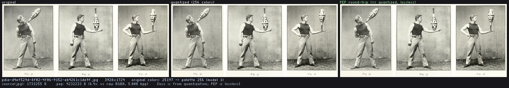

PEP is a **palette codec for low-color images**: it runs a per-channel PPM model
over a ≤256-color palette and keeps the model that produces the smallest output.
It shines on pixel art and other low-color content; it does *not* beat JPEG on
photographs — photographic input here is quantized to ≤256 colors first, so the
resulting `.pep` files are larger than the source JPEGs (expected for a palette
codec on photos).

## What this project is for

Two purposes:

1. **The actual optimized compression path** — a per-model encoder about twice as
   fast as the reference's, with output held byte-identical to the reference's.
2. **A reproducible case study of using an LLM to do the optimization** — what the
   human did, what the model did, and what the harness verified.

## Methodology — four documents, four phases

1. [`prompts/create-reference.md`](prompts/create-reference.md) → the reference
   pipeline in [`src/`](src/): load (stb_image) → deterministic median-cut
   quantize to ≤256 colors → `pep_compress` (the one timed call) → `pep_save` →
   lossless round-trip check. Single-threaded, deterministic, libc/libm + vendored
   single-headers only.
2. [`prompts/create-optimized-test-harness.md`](prompts/create-optimized-test-harness.md)
   → the comparator (decompressed-pixel match, relaxed from byte-identity), the
   generalization generator, the committed images, and the determinism check. It
   was built and **proven against an identity copy** (`src-optimized/` ==
   `src/`, ≈1.0×) *before* any optimization, as iteration-0 evidence the
   measurement pipeline is sound.
3. [`prompts/create-optimized.md`](prompts/create-optimized.md) → the optimization
   instructions: profile first, rank candidates by payoff, hold the pixel-identity
   gate plus the size and decode gates, treat representation/data-pattern changes
   and SIMD/layout as first-class.
4. [`prompts/create-visualizer.md`](prompts/create-visualizer.md) → the quality
   visualizer (its own section below).

## What was optimized

The wins that carry the ~2× all make the *per-model* encode faster (the reference
also encodes per model, so they apply on every pass). Full per-hypothesis history,
rejected attempts, and the size/speed frontier are in
[`src-optimized/OPTIMIZATION-LOG.md`](src-optimized/OPTIMIZATION-LOG.md).

| Kept | What it does |
|---|---|
| Palette hash lookup | O(1) index build vs the reference's per-pixel linear palette scan |
| Block-prefix frequency sums (16-symbol blocks) | O(blocks) cumulative-frequency query vs a linear scan |
| Encoder model-kind specialization | straight-line per-kind hot path instead of generic dispatch |
| Encoder-only padded neighbor taps | drops boundary checks on the common path |
| Local arithmetic-coder state + escape fast path | branch/memory savings per symbol |
| Early-abandon + count-only loser evaluation | +30% (1.57× → 2.04×): losing models stop early |

## The visualizer

[`viz/`](viz/) is a small C tool (`viz/contact_sheet.c`) that renders, one image
at a time, a side-by-side comparison: the **original** photo, the **quantized**
version (≤256 colors, what PEP actually compresses), and the **PEP round-trip**
(the decompressed `.pep`). PEP is lossless on palettized pixels, so the quantized
and round-trip panels are pixel-identical — all visible loss is from quantization,
not from PEP. The screenshots in [`viz/shots/`](viz/shots/) came from this tool.
Regenerate them with:

```sh
make all && make input && ./run-performance-test   # produce results.txt + .pep
make -C viz shots                                   # write viz/shots/*.png
```

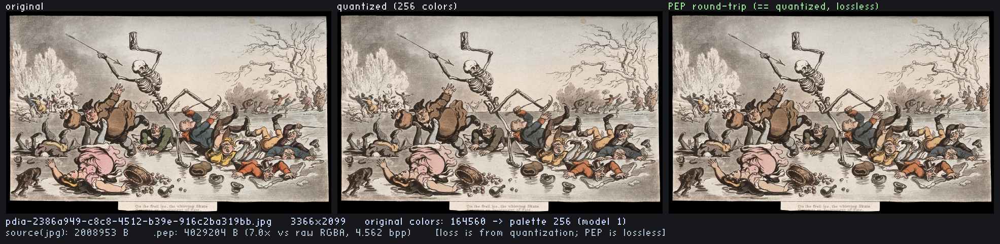
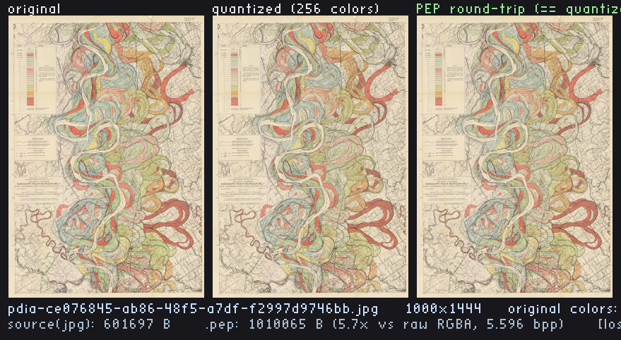

## Per-image results

All 24 committed images, largest to smallest. The optimized `.pep` is byte-identical to the reference's in every case (size ratio 1.00×). `.pep` sizes are from the two `results.txt` files; source JPEG bytes from `stat`; compress times are per-image median-of-5.

#### pdia-01abb915-b1ca-43ad-b73a-b3d1f3258543 — 2564×3028
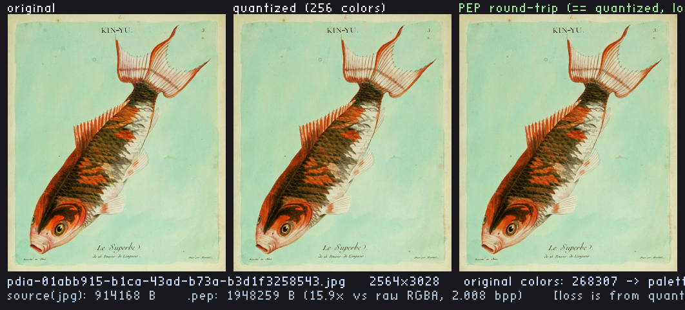

| metric | reference | optimized |
|---|--:|--:|
| source JPEG | 914,168 B | — |
| `.pep` size | 1,948,259 B | 1,948,259 B (1.00×, byte-identical) |
| compress time | 2.064708 s | 0.793117 s |
| speedup | — | ~2.60× |

#### pdia-2386a949-c8c8-4512-b39e-916c2ba319bb — 3366×2099


| metric | reference | optimized |
|---|--:|--:|
| source JPEG | 2,008,953 B | — |
| `.pep` size | 4,029,204 B | 4,029,204 B (1.00×, byte-identical) |
| compress time | 2.099999 s | 0.992530 s |
| speedup | — | ~2.12× |

#### pdia-d4ef529d-8f02-4f06-9152-eb4261c1de9f — 3928×1724


| metric | reference | optimized |
|---|--:|--:|
| source JPEG | 1,733,255 B | — |
| `.pep` size | 4,232,233 B | 4,232,233 B (1.00×, byte-identical) |
| compress time | 2.035886 s | 1.019124 s |
| speedup | — | ~2.00× |

#### pdia-53283bc4-893f-44e0-8926-ec87a4f30bf1 — 2430×2662
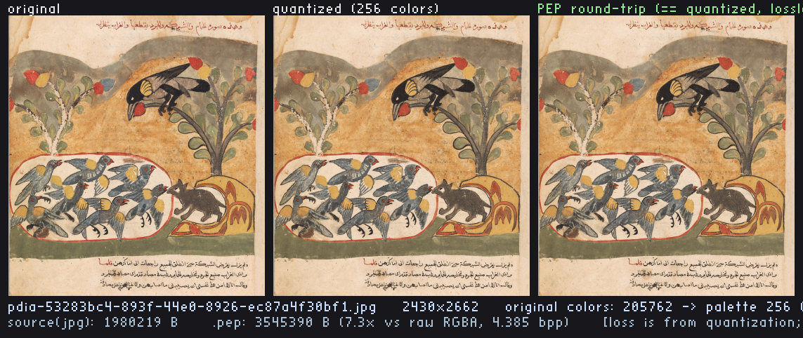

| metric | reference | optimized |
|---|--:|--:|
| source JPEG | 1,980,219 B | — |
| `.pep` size | 3,545,390 B | 3,545,390 B (1.00×, byte-identical) |
| compress time | 2.075213 s | 0.953556 s |
| speedup | — | ~2.18× |

#### pdia-fc364b09-e5a1-4572-a023-93eb3d36061f — 2448×2004
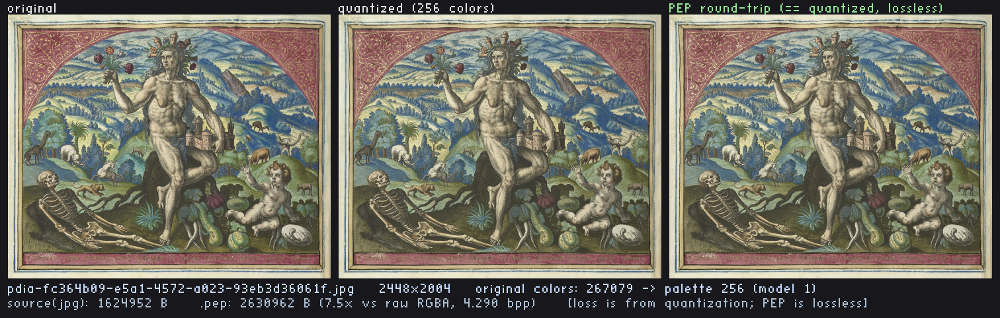

| metric | reference | optimized |
|---|--:|--:|
| source JPEG | 1,624,952 B | — |
| `.pep` size | 2,630,962 B | 2,630,962 B (1.00×, byte-identical) |
| compress time | 1.574237 s | 0.728895 s |
| speedup | — | ~2.16× |

#### pdia-612332fd-21c6-47df-9c77-f6111392479c — 1839×2007
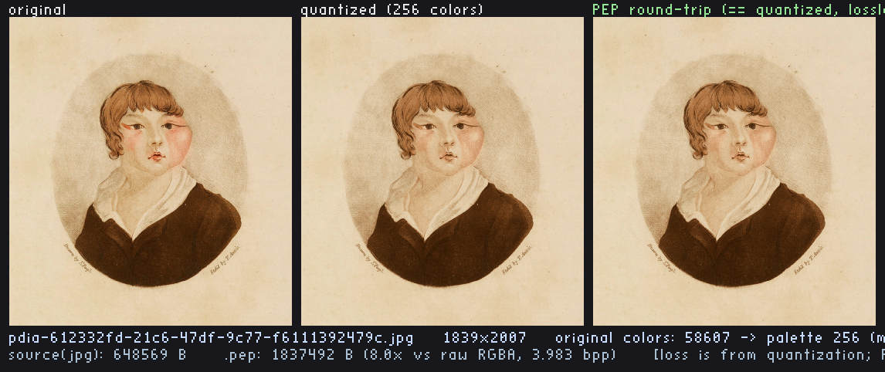

| metric | reference | optimized |
|---|--:|--:|
| source JPEG | 648,569 B | — |
| `.pep` size | 1,837,492 B | 1,837,492 B (1.00×, byte-identical) |
| compress time | 1.177268 s | 0.510195 s |
| speedup | — | ~2.31× |

#### pdia-05e43989-bf4b-4929-a50e-12516161f49e — 1626×2166
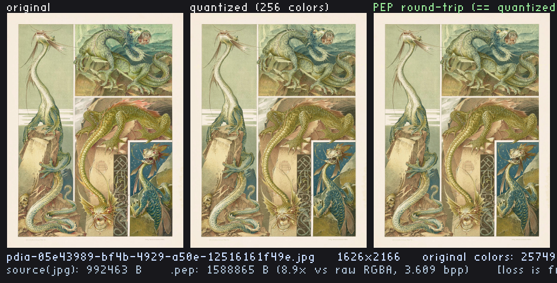

| metric | reference | optimized |
|---|--:|--:|
| source JPEG | 992,463 B | — |
| `.pep` size | 1,588,865 B | 1,588,865 B (1.00×, byte-identical) |
| compress time | 1.005442 s | 0.456715 s |
| speedup | — | ~2.20× |

#### pdia-d150b534-7bcd-45ef-97fb-5b55534cca51 — 1400×1168
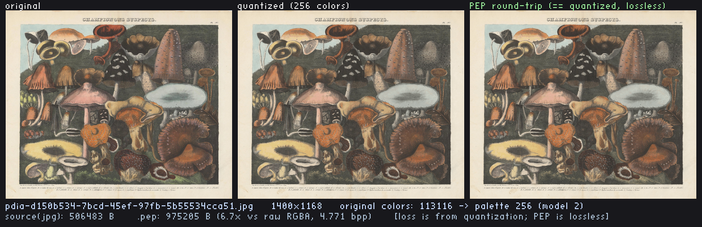

| metric | reference | optimized |
|---|--:|--:|
| source JPEG | 506,483 B | — |
| `.pep` size | 975,205 B | 975,205 B (1.00×, byte-identical) |
| compress time | 0.591814 s | 0.316524 s |
| speedup | — | ~1.87× |

#### pdia-4b688542-9513-4208-bf91-e19f75ecf0e6 — 995×1500
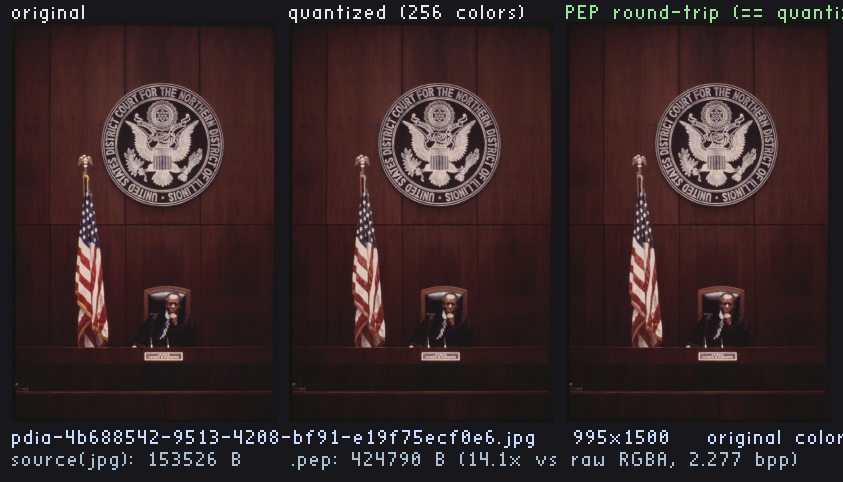

| metric | reference | optimized |
|---|--:|--:|
| source JPEG | 153,526 B | — |
| `.pep` size | 424,790 B | 424,790 B (1.00×, byte-identical) |
| compress time | 0.439591 s | 0.185576 s |
| speedup | — | ~2.37× |

#### pdia-ce076845-ab86-48f5-a7df-f2997d9746bb — 1000×1444


| metric | reference | optimized |
|---|--:|--:|
| source JPEG | 601,697 B | — |
| `.pep` size | 1,010,065 B | 1,010,065 B (1.00×, byte-identical) |
| compress time | 0.579582 s | 0.319554 s |
| speedup | — | ~1.81× |

#### pdia-d5c67276-9478-40aa-a9ca-c07e9b13f340 — 1091×1200
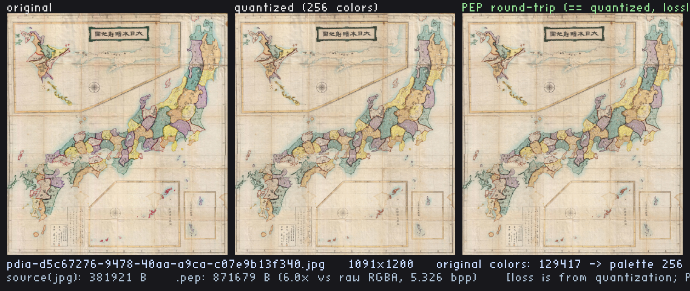

| metric | reference | optimized |
|---|--:|--:|
| source JPEG | 381,921 B | — |
| `.pep` size | 871,679 B | 871,679 B (1.00×, byte-identical) |
| compress time | 0.518571 s | 0.279484 s |
| speedup | — | ~1.86× |

#### pdia-ff99bb54-cc92-4428-8f1a-c40a076537db — 934×1400
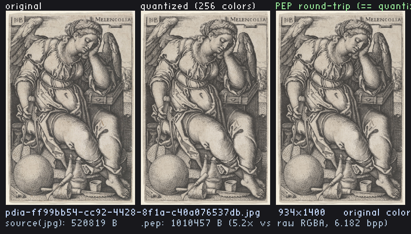

| metric | reference | optimized |
|---|--:|--:|
| source JPEG | 520,819 B | — |
| `.pep` size | 1,010,457 B | 1,010,457 B (1.00×, byte-identical) |
| compress time | 0.540231 s | 0.306930 s |
| speedup | — | ~1.76× |

#### pdia-03409a0c-aa38-4741-b250-db965a8901d1 — 968×1200
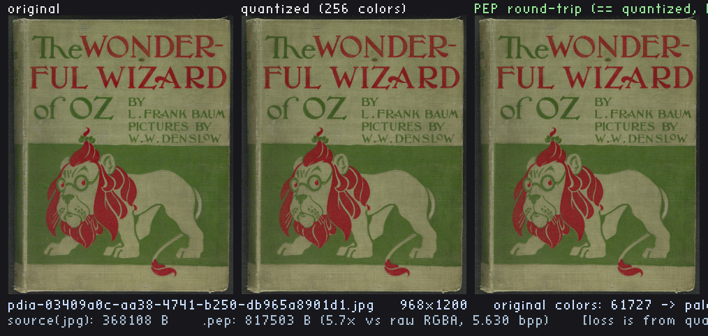

| metric | reference | optimized |
|---|--:|--:|
| source JPEG | 368,108 B | — |
| `.pep` size | 817,503 B | 817,503 B (1.00×, byte-identical) |
| compress time | 0.454465 s | 0.261817 s |
| speedup | — | ~1.74× |

#### pdia-19006612-b225-4dc3-81b5-adfcb20ed0da — 826×1400
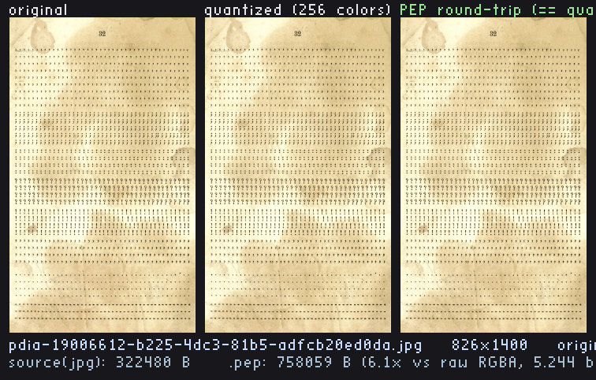

| metric | reference | optimized |
|---|--:|--:|
| source JPEG | 322,480 B | — |
| `.pep` size | 758,059 B | 758,059 B (1.00×, byte-identical) |
| compress time | 0.448335 s | 0.251097 s |
| speedup | — | ~1.79× |

#### pdia-5d46dfcd-8d1a-4803-943b-1ee67cb08f08 — 832×1200
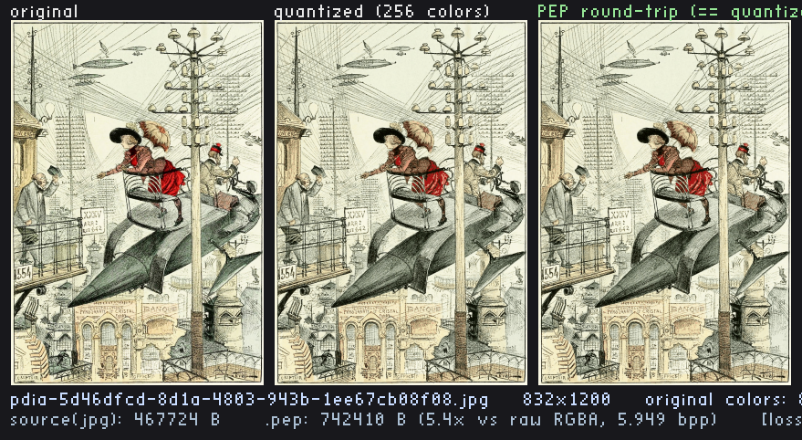

| metric | reference | optimized |
|---|--:|--:|
| source JPEG | 467,724 B | — |
| `.pep` size | 742,410 B | 742,410 B (1.00×, byte-identical) |
| compress time | 0.423661 s | 0.247444 s |
| speedup | — | ~1.71× |

#### pdia-3ea6d07d-3a99-42bc-80c9-08acddf3f30d — 1155×750
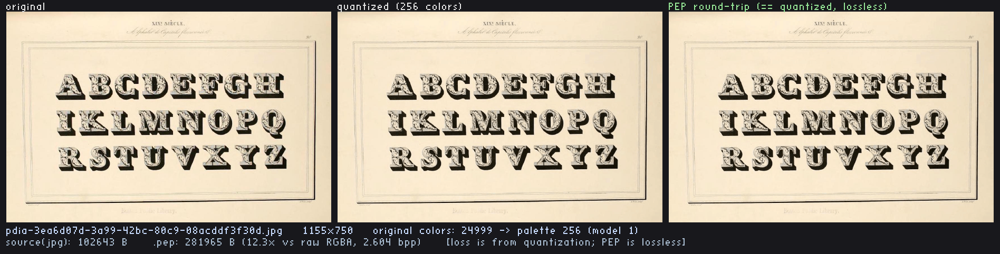

| metric | reference | optimized |
|---|--:|--:|
| source JPEG | 102,643 B | — |
| `.pep` size | 281,965 B | 281,965 B (1.00×, byte-identical) |
| compress time | 0.232527 s | 0.139050 s |
| speedup | — | ~1.67× |

#### pdia-c4603a5a-7429-4657-b892-2b315c996f7c — 1064×750
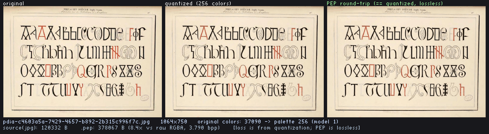

| metric | reference | optimized |
|---|--:|--:|
| source JPEG | 120,332 B | — |
| `.pep` size | 378,067 B | 378,067 B (1.00×, byte-identical) |
| compress time | 0.271251 s | 0.164521 s |
| speedup | — | ~1.65× |

#### pdia-1fcfdb35-359a-4d45-82d2-cfa9ffa11830 — 1003×750
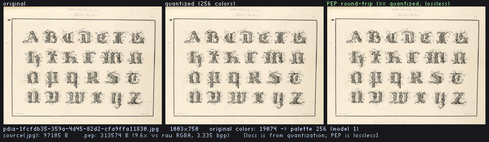

| metric | reference | optimized |
|---|--:|--:|
| source JPEG | 97,105 B | — |
| `.pep` size | 313,574 B | 313,574 B (1.00×, byte-identical) |
| compress time | 0.232039 s | 0.138872 s |
| speedup | — | ~1.67× |

#### pdia-cd49a2c5-2683-4772-b049-6f64b4c5ca54 — 987×750
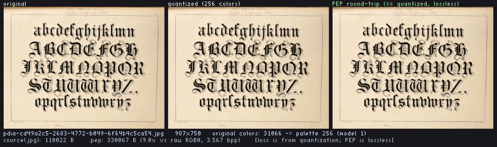

| metric | reference | optimized |
|---|--:|--:|
| source JPEG | 110,022 B | — |
| `.pep` size | 330,067 B | 330,067 B (1.00×, byte-identical) |
| compress time | 0.254183 s | 0.148711 s |
| speedup | — | ~1.71× |

#### pdia-ec223bb3-7cf7-4751-b56a-a0a14f865646 — 712×867
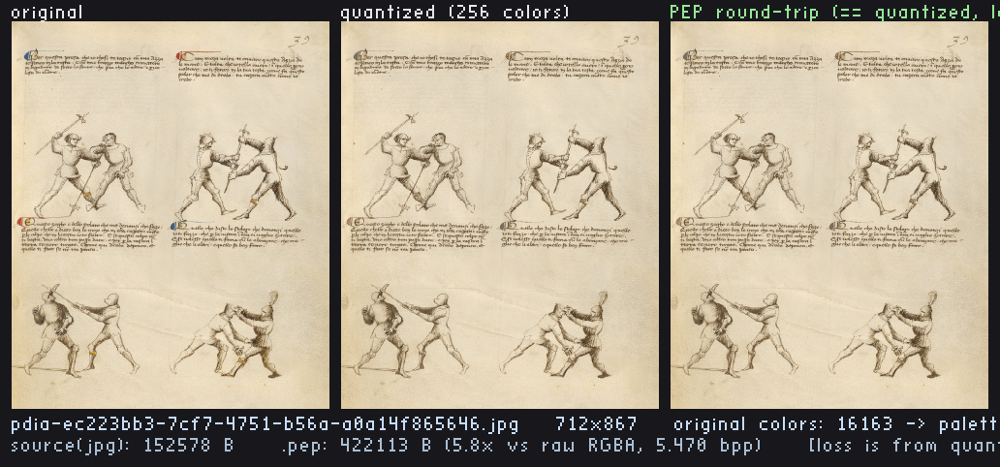

| metric | reference | optimized |
|---|--:|--:|
| source JPEG | 152,578 B | — |
| `.pep` size | 422,113 B | 422,113 B (1.00×, byte-identical) |
| compress time | 0.271003 s | 0.170821 s |
| speedup | — | ~1.59× |

#### pdia-0c270f5d-8440-40c1-88cd-a5cc4462d38b — 596×1024
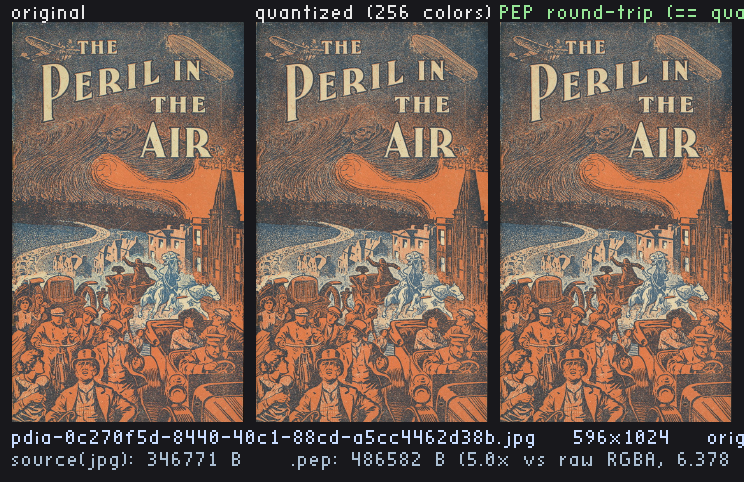

| metric | reference | optimized |
|---|--:|--:|
| source JPEG | 346,771 B | — |
| `.pep` size | 486,582 B | 486,582 B (1.00×, byte-identical) |
| compress time | 0.291574 s | 0.189585 s |
| speedup | — | ~1.54× |

#### pdia-183bbd19-1371-45ad-a386-15fb8d433929 — 600×810
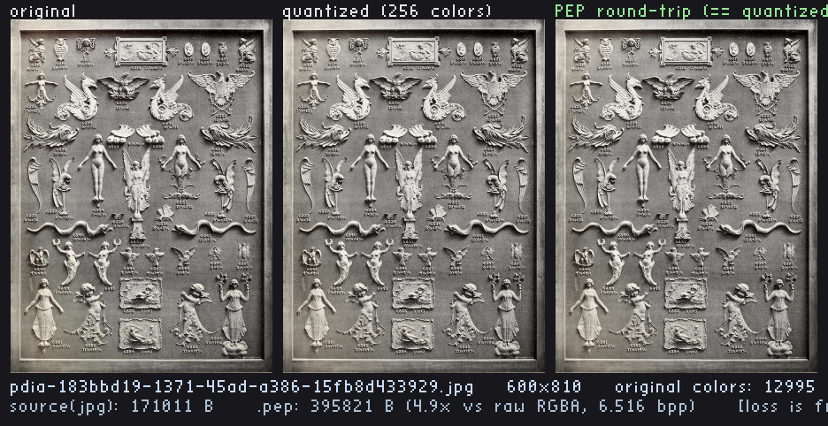

| metric | reference | optimized |
|---|--:|--:|
| source JPEG | 171,011 B | — |
| `.pep` size | 395,821 B | 395,821 B (1.00×, byte-identical) |
| compress time | 0.242684 s | 0.166157 s |
| speedup | — | ~1.46× |

#### pdia-07549118-a593-4e0e-8aa1-6a9ae1e626f3 — 553×800
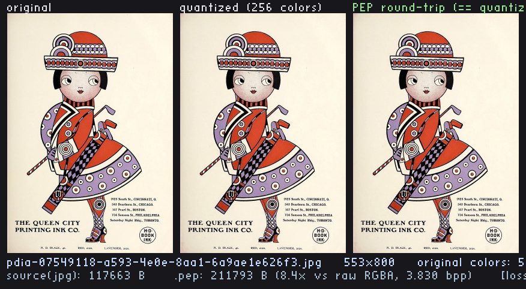

| metric | reference | optimized |
|---|--:|--:|
| source JPEG | 117,663 B | — |
| `.pep` size | 211,793 B | 211,793 B (1.00×, byte-identical) |
| compress time | 0.176166 s | 0.116885 s |
| speedup | — | ~1.51× |

#### pdia-81d136ce-eaac-4995-92b9-686c4ad535e1 — 562×750
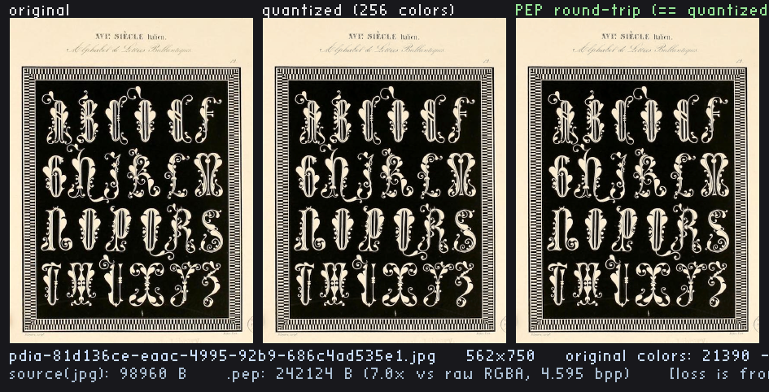

| metric | reference | optimized |
|---|--:|--:|
| source JPEG | 98,960 B | — |
| `.pep` size | 242,124 B | 242,124 B (1.00×, byte-identical) |
| compress time | 0.175094 s | 0.116294 s |
| speedup | — | ~1.51× |

Aggregate across all 24: reference median ~17.5 s → optimized median ~8.6 s, **2.04×** (per-image ~1.5–2.6×).

## Reproduce it yourself

```sh
# Reference: build, quantize the committed images, run the reference harness
make clean && make all
make input
./run-performance-test                       # writes performance-test/results.txt

# Optimized: build and run the full correctness suite against the optimized lib
make -f Makefile.optimized optimized
./build/test_runner_opt                      # 13/13
./run-performance-test-optimized             # writes performance-test-optimized/results.txt

# The reference test suite
make test                                    # ./build/test_runner

# The full per-run proof (clean build, all gates, median-of-5; takes a few minutes)
./prove-optimized-harness.sh

# The visualizer
make -C viz shots                            # writes viz/shots/*.png
```

## Citation and license

PEP is by **ENDESGA** ([github.com/ENDESGA/PEP](https://github.com/ENDESGA/PEP)),
released under **CC0 1.0**. The vendored `stb` single-header libraries
(`stb_image.h`, `stb_image_write.h`, `stb_easy_font.h`, from
[nothings/stb](https://github.com/nothings/stb)) carry their own public-domain/MIT
terms.

The project as a whole is **MIT** ([`LICENSE`](LICENSE)) — that covers the harness,
prompts, tests, tooling, and build scripts. The image codec sources under
[`src/`](src/) and [`src-optimized/`](src-optimized/) are dedicated to the public
domain under **CC0 1.0 Universal** ([`src/LICENSE`](src/LICENSE),
[`src-optimized/LICENSE`](src-optimized/LICENSE)) to match the upstream PEP project
(CC0 1.0) that `pep.h` derives from. No terms here go beyond what those files state.
